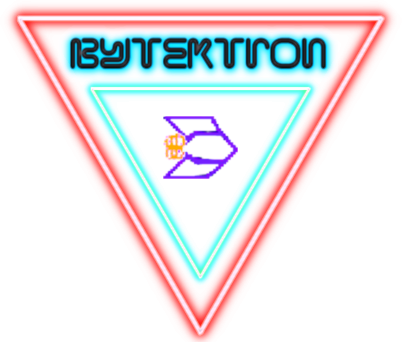

# <i style="display:none;">TOP</i>  
> -----------------------------------------------------------------------------------------------------  
>     
> '**BytekTron**' (Lua LÖVE Program) - Juego tipo "spatial-shooter". siguiendo un tutorial en https://github.com/a327ex/blog/issues/30.  
> Author:  Juan José Guerra Haba - <dinertron@gmail.com> - Junio, 2024  
> Web:     https://guerratron.github.io/ , https://grtron.es  
> License: Free BSD. & Open GPL v.3. Keep credit, please.  
> Idea Original: **[a327ex](https://a327ex.com/)**  
> Versión: 1.0.0  
> Proyect:    BytekTron Lua-Löve      Package: /               Entry-Point: main.lua  
> 
> ----------------------------------------------------------------------------------------------------  

<h3>🖇️ Tabla de contenidos</h3>
 
- [⚙️ Introducción](#prefacio)
- [📋 Antecedentes](#antecedentes)
- [⌨️ Caracteristicas](#caracteristicas)
- [🔧 Comandos](#comandos)
- [📌 Fuentes](#fuentes)

## PREFACIO:
 ⚙️  
En un plácido planeta llamado **BytekTron** situado en la Galaxia Intermedia, habitan pacíficos seres pseudo-humanos, los **Bytekis** que se ocupan de recopilar los valiosos recursos llegados del firmamento en forma de lluvia de meteoritos; en especial el mineral "SP", un mineral con propiedades energéticas especiales que sirven en multitud de propósitos.

Este mineral está áltamente valorado en los planetas vecinos de la Galaxia, donde precísamente escasea; es por esto que han sufrido una conquista planetaria promovida por unos invasores enemigos que dominan una tecnología superior.

Tras años de esclavitud trabajando en las llanuras de meteoritos recogiendo minerales para ellos, una región insurgente de *bytekis* escapó y ahora vive refugiada en recónditas cuevas a la espera de la llegada de algún salvador.

**Siket**, un miembro de los insurgentes, tiene un plan ideado. Está intentando formar un escuadrón de ataque contra las fuerzas enemigas con el objetivo principal de secuestrales sus avanzadas *naves espaciales*. 

Al ejecutar este sabotaje consiguió sustraerles una *nave básica*, pero perdió muchos hombres en el intento ..

.. Ahora se ve sólo, **NECESITA TU AYUDA** para conseguir arrebatarles todas sus naves y por fin liberar a su pueblo oprimido.

¡ NO LE FALLES ! alístate con los renegados para salvar este pacífico planeta: **El Planeta BytekTron**

## ANTECEDENTES:
 📋  
 BytekTron: Es el resultado del seguimiento de un tutorial (SUPER-TUTORIAL) encontrado en https://github.com/a327ex/blog/issues/30.

Esta versión se ha basado en anteriores versiones de prueba de "NEW_GAME_1 (1_TIMER)".

Es un típico juego retro-espacial de naves tipo **shooter** 🚀 , donde se necesitan ir acumulando "Skill-points" para intercambiarlos por nuevas naves más potentes.

## CARACTERISTICAS
⌨️  
La parte más original del juego, a mi parecer, es precísamente lo que no es "juego", quiero decir las otras pantallas donde intercambiamos Skill-points por recursos, el Mapa de Habilidades, La Selección de Naves, La Pantalla de Logros, .. y la forma de llegar a ellas a través de una pantalla tipo **consola** o **terminal** ⌨️  donde se introducen comandos apropiados para navegar entre estas pantallas y la del juego en sí.

Así que tenemos un juego tipo **shooter-espacial**, con temática **retro-futurista**, con aspecto de juego **arcade-8-bits** basado en consola tipo **MS-Dos**, con alta jugabilidad y colores neón (casi **cyberpunk**), con imágenes animadas **100% vectorizadas al vuelo** ... y encima programado en **LÖVE** (Lua 5.1), ...

 **¡ QUE MÁS SE PUEDE PEDIR !**, el disfrute está asegurado para todos los que añoren los **años 80's**.

 P.D: El juego sólo se ha podido probar en una máquina potente moderna (i7-64bits, 12Gb RAM, 2 Tb HDD) nada (*retro-futurista*), y consume entre 3 y 70 Mb de memoria (dependiendo del tiempo jugado y pantallas visualizadas).

{: name="comandos" id="comandos"}
## COMANDOS:
 🔧  
(BÁSICOS)  

    - start. Comienza el juego (a recoger 'skill-points').
    - ship. Pantalla de Selección de Naves.
    - skill. Mapa de Habilidades.
    - ach. Pantalla de Logros conseguidos.
    - help. Pantalla de ayuda. 
    - exit. Salir del juego guardando los avances conseguidos. 
    - escape. Salir del juego SIN guardar los avances.
    - ... y muchos otros comandos de utilidad (ver 'commands').

## FUENTES:
 📌  
Ideas cogidas sobre todo del completísimo y maravilloso tutorial:

- https://github.com/a327ex/blog/issues/30

 🎁  
... Muchas gracias a todos, en especial: a [a327ex](https://a327ex.com/) por su fascinante tutorial en *Lua* y en general a todo el mundo altruista que genera código y lo dispone open-source.  

... y sobre todo al mundo **spatial-cyberpunk** por la estética **retro-futurista** acuñada.  

> ✒️  
> :: BY: Juan Jose Guerra Haba <dinertron@gmail.com> GuerraTron24  

^[TOP](#top)^